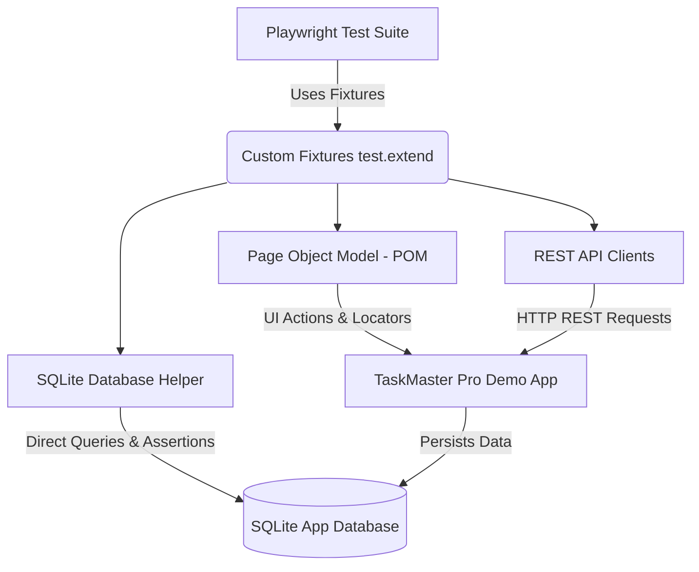

# 🎭 Enterprise Playwright & TypeScript Test Automation Showcase

An enterprise-grade, end-to-end test automation framework built with **Playwright**, **TypeScript**, **REST API Integration**, **Direct Database Assertions (SQLite)**, and **CI/CD Pipeline** capabilities.

Designed to serve as a complete portfolio demonstration of modern Test Automation Engineering best practices.

---

## 🌟 Key Highlights & Core Subjects Covered

1. **Automation Core & Architecture**:
   - Built using **TypeScript** with strict type safety.
   - **Page Object Model (POM)** pattern enforcing clean separation of concerns.
   - **Custom Playwright Fixtures (`test.extend`)** binding Page Objects, API clients, and DB helpers seamlessly into test contexts.
   - **Custom Logger** providing formatted console logs and automatic attachment of step details to Playwright HTML reports.
   - Test data generation using `@faker-js/faker`.

2. **REST API Automation**:
   - Native API testing utilizing Playwright's `APIRequestContext`.
   - Complete CRUD endpoint coverage (`GET`, `POST`, `PUT`, `DELETE`).
   - Response status code, JSON payload schema structure, and authorization error assertions.
   - **Hybrid Testing (Fast Auth Bypass)**: Bypassing UI login forms by issuing direct REST API login calls and injecting JWT tokens directly into `localStorage`.

3. **Database Integration (SQLite)**:
   - Direct database client helper (`DbHelper`) executing queries straight against SQLite DB.
   - Pre-seeding database records before test execution and automated cleanup.
   - **End-to-End Data Verification**: Asserting that UI form submissions correctly persist records in the backend database.

4. **Self-Contained Demo Target Application**:
   - Built-in lightweight **Node.js/Express + SQLite** REST API & frontend dashboard (`/app`).
   - 100% offline-runnable, free, self-contained, and deterministic (no flaky external site dependencies).

5. **CI/CD Pipeline**:
   - GitHub Actions workflow (`.github/workflows/playwright.yml`).
   - Sharded test matrix execution across multiple workers.
   - Test report artifact uploading and trace retention on failure.

---

## 📐 Framework Architecture



---

## 🛠️ Technology Stack (100% Free & Open Source)

- **Test Runner & Automation**: [Playwright Test Runner](https://playwright.dev/) (`@playwright/test`)
- **Language**: [TypeScript](https://www.typescriptlang.org/)
- **Target Backend**: [Express.js](https://expressjs.com/) with JWT Authentication
- **Database**: [SQLite3](https://www.sqlite.org/)
- **Data Generator**: [@faker-js/faker](https://fakerjs.dev/)
- **CI/CD Engine**: GitHub Actions Workflow

---

## 📁 Repository Structure

```text
├── .github/
│   └── workflows/
│       └── playwright.yml        # CI/CD Matrix Sharding Workflow
├── app/
│   ├── db.ts                     # SQLite DB Connection & Schema Setup
│   ├── server.ts                 # Express REST API Server
│   └── public/
│       └── index.html            # Target Web Dashboard UI
├── src/
│   ├── api/
│   │   ├── clients/              # Auth & Task REST API Clients
│   │   └── utils/                # API Helper & Hybrid Auth Bypass
│   ├── core/
│   │   ├── config/               # Environment Configuration
│   │   ├── fixtures/             # Custom Playwright Fixtures
│   │   └── utils/                # Logging & Helper Utilities
│   ├── database/
│   │   └── db.helper.ts          # SQLite Query & DB Assertion Helper
│   └── pages/
│       ├── base.page.ts          # Common Base Page Class
│       ├── login.page.ts         # Login Page Object
│       └── dashboard.page.ts     # Dashboard & Modal Page Object
├── tests/
│   ├── api/                      # REST API Test Suite
│   ├── hybrid/                   # Hybrid (API + DB + UI) Workflow Test
│   └── ui/                       # UI & Database Integration Tests
├── package.json
└── playwright.config.ts          # Main Playwright Configuration
```

---

## 🚀 Quick Start & Local Test Execution

### 1. Installation

```bash
# Clone repository and install dependencies
npm install

# Install Playwright browser binaries
npx playwright install
```

### 2. Running Tests

The framework automatically launches the target Express server before running tests via Playwright's `webServer` config.

```bash
# Execute all test suites across Chromium, Firefox, WebKit
npm test

# Open Playwright Interactive UI Mode (Great for debugging!)
npm run test:ui

# Execute only REST API tests
npm run test:api

# Execute UI & Database Integration tests
npm run test:db

# View interactive HTML Test Report
npm run test:report
```

---

## 📊 Sample Test Scenarios Implemented

| Category | Test File | Description |
| :--- | :--- | :--- |
| **UI** | `tests/ui/login.spec.ts` | Valid login, invalid credentials, logout workflows |
| **UI + DB** | `tests/ui/task-management.spec.ts` | Creates task via UI and asserts exact record presence in SQLite DB |
| **REST API** | `tests/api/tasks-api.spec.ts` | Verifies `/api/v1/auth` and `/api/v1/tasks` CRUD endpoints & status codes |
| **Hybrid** | `tests/hybrid/hybrid-workflow.spec.ts` | Pre-seeds DB, bypasses UI login via API token injection into `localStorage`, and validates UI rendering |

---

## 📜 License

MIT License - Open Source & Free to use for learning, showcasing, and commercial adaptation.
